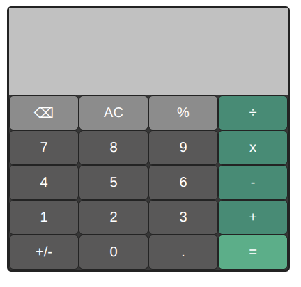
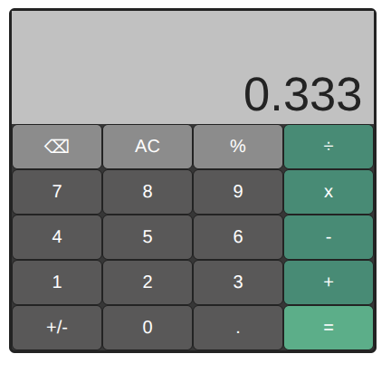

# Calculator

A working calculator built with HTML, CSS, and JavaScript as part of [The Odin Project](https://www.theodinproject.com/lessons/foundations-calculator) foundations course.

## Live Demo
[View it live](https://nathanjspriegel.github.io/calculator/)

## What I practiced
- Flexbox for layout
- DOM manipulation and event listeners
- Managing application state across multiple functions (tracking current input, stored operand, and selected operator)
- Debugging errors like duplicate event listeners firing on the same button
- Handling edge cases (chained operations, divide by zero, decimal points, negative numbers)

## Built with
- HTML5
- CSS3
- JavaScript

## Ideas to improve
- Making the layout responsive for different screen sizes
- Adding animations/transitions on button press
- Supporting parentheses and more complex expressions
- Custom themes 

## Screenshots

